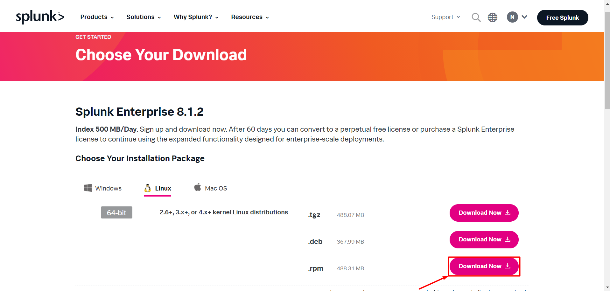
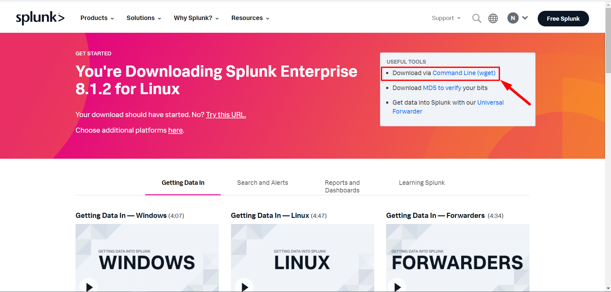

# Cài đặt splunk enterprise trên centos 7 

Nếu bạn chưa có tài khoản splunk, hãy truy cập vào [splunk.com](https://www.splunk.com/) và kích vào `Free Splunk` để tạo tài khoản cho splunk. 


Sau khi có tài khoản, hãy truy cập đường link sau để download splunk enterprise: [Splunk enterprise linux](https://www.splunk.com/en_us/download/splunk-enterprise.html#tabs/linux)

Vì splunk mình cài trên centos 7 nên mình chọn RPM.



Sau đó chọn cú pháp câu lệnh tải về sử dụng `wget`. 



Lưu lại cú pháp câu lệnh để chạy trên server. 


### 2. Cài đặt splunk

SSH vào máy chủ splunk

- Update và tải gói cần thiết: 

```
yum update -y

yum install -y wget
```


- Tải về splunk: 

Dán cú pháp lệnh đã copy được ở trên để tải về splunk. Ví dụ câu lệnh của mình copy được như sau:

```
wget -O splunk-8.1.2-a0c54a88db66-linux-2.6-x86_64.rpm 'https://www.splunk.com/bin/splunk/DownloadActivityServlet?architecture=x86_64&platform=linux&version=8.1.2&product=splunk&filename=splunk-8.1.2-a0c54a88db66-linux-2.6-x86_64.rpm&wget=true'
```

- Cài đặt splunk: 

Vì mỗi người có 1 tài khoản riêng nên tên gói sẽ khác nhau, bạn hãy thay `splunk-8.1.2-a0c54a88db66-linux-2.6-x86_64.rpm` bằng tên gói của mình nhé: 

```
rpm -i splunk-8.1.2-a0c54a88db66-linux-2.6-x86_64.rpm
```

- Tiếp đó khởi động splunk: 

```
/opt/splunk/bin/splunk  start --accept-license
```


- Tắt firewall: 

```
systemctl stop firewalld
systemctl disable firewalld
```

- Sau đó sử dụng địa chỉ `http://ip_splunk_enterprise:8000/en-US` để truy cập server. 

