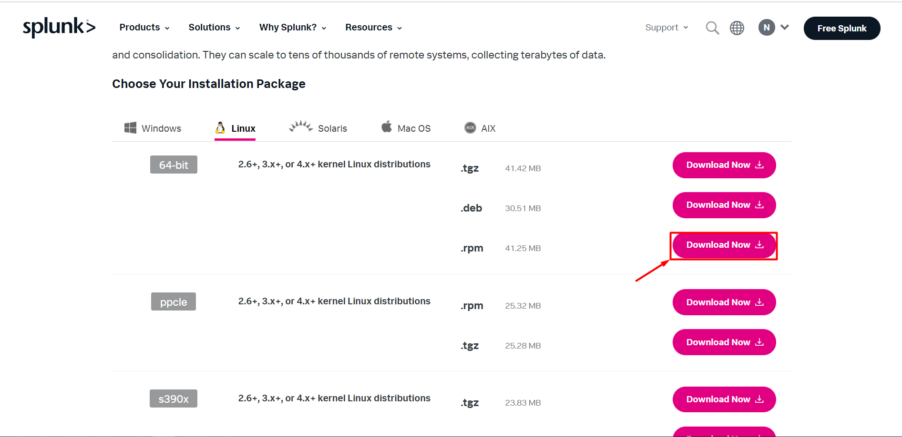

# Cấu hình thu thập log centos 7 thông qua splunk forwarder

## Lấy cú pháp cài đặt plunk forwarder

Ở phần trước mình đã tạo tài khoản splunk nên lần này mình k tạo lại nữa mà trực tiếp truy cập để tải splunk forwarder luôn.

Sau khi có tài khoản, hãy truy cập đường link sau để download splunk forwarder: [Splunk forwarder linux](https://www.splunk.com/en_us/download/universal-forwarder.html#tabs/linux)

Vì mình cài trên centos 7 nên mình chọn RPM.



Sau đó chọn cú pháp câu lệnh tải về sử dụng `wget`. 


Lưu lại cú pháp câu lệnh để chạy trên server. 


### 2. Cài đặt splunk forwarder

- Update và tải gói cần thiết: 

```
yum update -y

yum install -y wget
```

- Tải về splunk forwarder:

Dán cú pháp lệnh đã copy được ở trên để tải về splunk. Ví dụ câu lệnh của mình copy được như sau:

```
wget -O splunkforwarder-8.1.2-545203gh57f70-linux-2.6-x86_64.rpm 'https://www.splunk.com/bin/splunk/DownloadActivityServlet?architecture=x86_64&platform=linux&version=8.1.2&product=universalforwarder&filename=splunkforwarder-8.1.2-545203gh57f70-linux-2.6-x86_64.rpm&wget=true'
```

- Cài đặt splunk forwarder:

Vì mỗi người có 1 tài khoản riêng nên tên gói sẽ khác nhau, bạn hãy thay `splunk-8.1.2-a0c54a88db66-linux-2.6-x86_64.rpm` bằng tên gói của mình nhé:

```
rpm -ivh splunkforwarder-8.0.2.1-545203gh57f70-linux-2.6-x86_64.rpm
```

- Tạo user, password: 

```
cat > /opt/splunkforwarder/etc/system/local/user-seed.conf << EOF
[user_info]
USERNAME = admin
PASSWORD = admin123
EOF
```

```
/opt/splunkforwarder/bin/splunk start --accept-license --answer-yes --auto-ports --no-prompt
/opt/splunkforwarder/bin/splunk enable boot-start
```

```
/opt/splunkforwarder/bin/splunk add forward-server ServerSplunk:port -auth admin:admin123
```
- Tạo file cấu hình: 

```
cat > /opt/splunkforwarder/etc/system/local/inputs.conf << EOF
[default]
host = client   
sourcetype = linuxOS
[monitor:///var/log/messages]
[monitor:///var/log/secure]
EOF
```

- Khởi động lại splunk

```
/opt/splunkforwarder/bin/splunk restart
rm -rf /opt/splunkforwarder/etc/system/local/user-seed.conf
rm -rf  splunkforwarder-8.0.2.1-545203gh57f70-linux-2.6-x86_64.rpm
```

- Thêm splunk server

```
/opt/splunkforwarder/bin/splunk add forward-server IP:Port
```

- Khởi động lại splunk:

```
/opt/splunkforwarder/bin/splunk restart 
```