# Tạo extract cho log ssh

Tại mục search, sử dụng cú pháp `Accepted` để tìm những log chứa thông tin đăng nhập ssh thành công. 

Kích vào `>` để xem chi tiết log: 

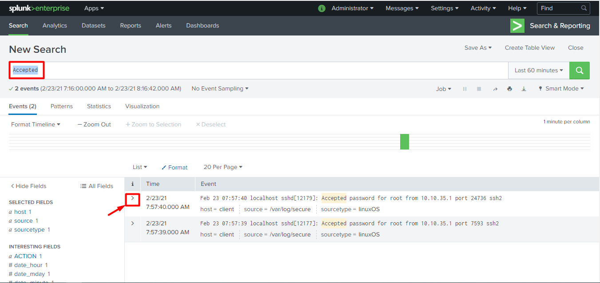

Tiếp theo, chọn `Event Actions` và chọn `Extract Fields`: 

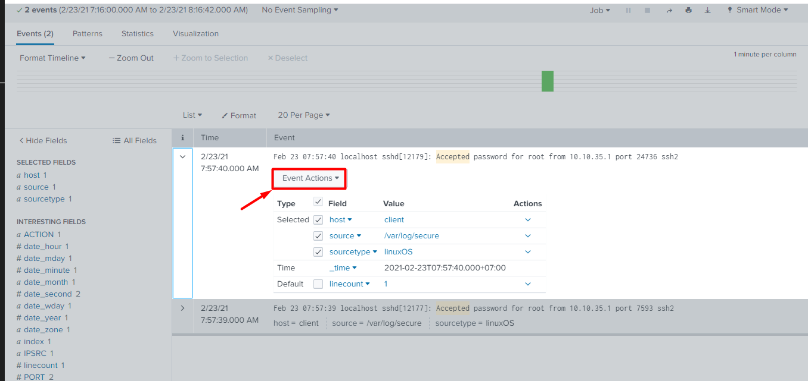

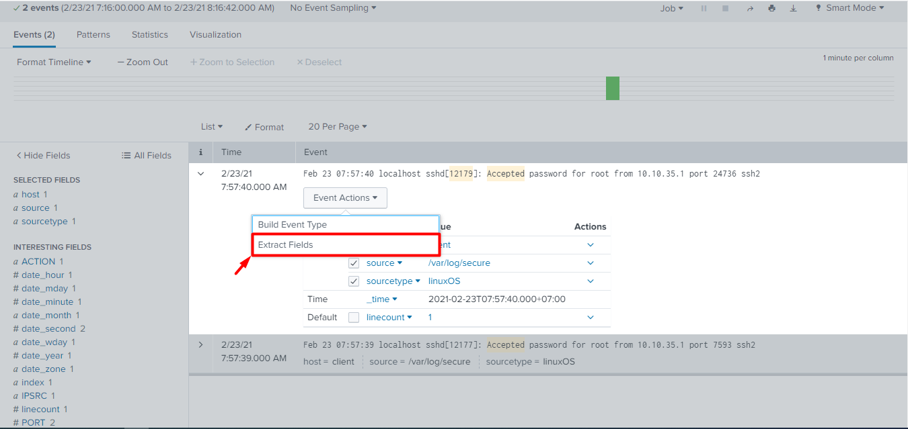

- Chọn `Regular Expression` sau đó chọn `Next` để extract: 

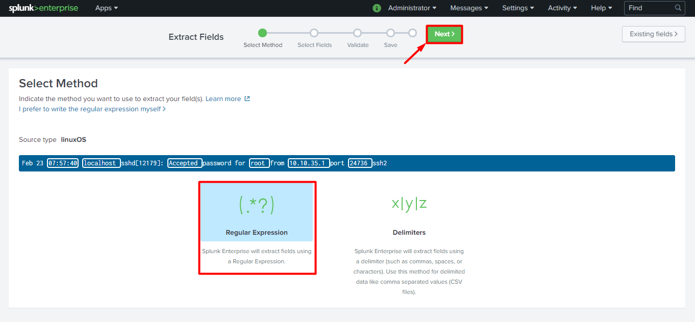

- Tại đây, nếu bạn muốn extract và đặt tên cho trường nào, thì bạn chỉ việc bôi đen nó, sau đó nhập vào `Field Name` cho nó. Ví dụ mình muốn extract trường `localhost` và mình đặt tên cho nó là `Source`, thì mình sẽ bôi đen trường `localhost`, khi đó sẽ có 1 ô nhảy lên để mình nhập `Field Name` cho nó, tại đây mình sẽ nhập là `Source`, sau đó chọn `Add Extraction` để thêm. 

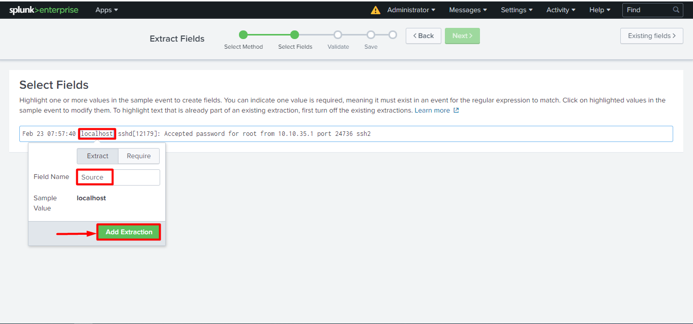

- Tương tự như vậy, mình tạo extract cho các trường `time`, `Accepted`, `ip`, `port`. Sau khi add và đặt `Field Name`, ta kiểm tra phía dưới xem các log đã được extract đúng hay chưa:

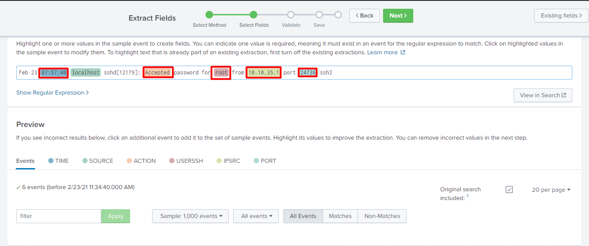

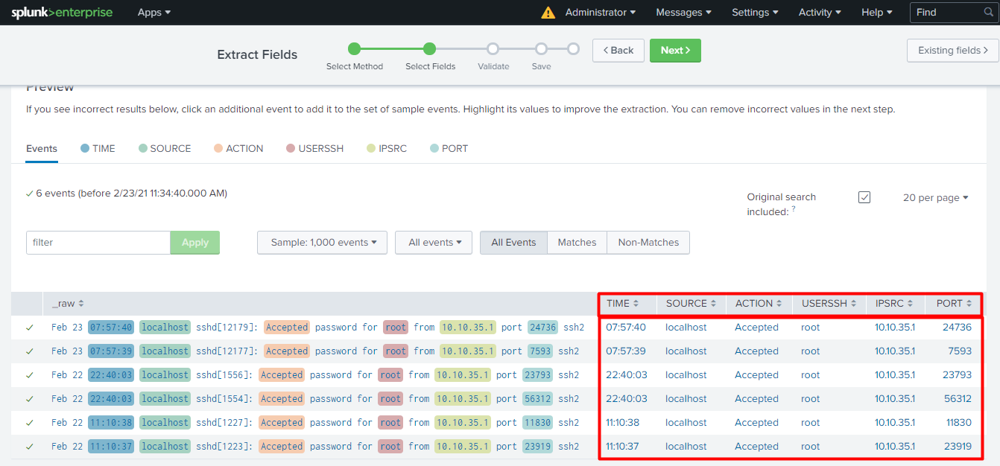

- Chọn `Next` để đến bước tiếp.

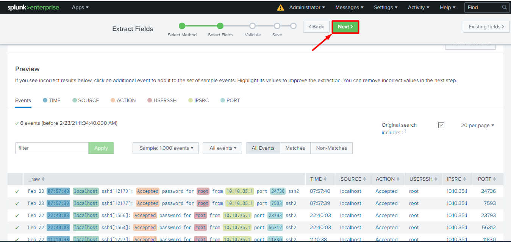

- Đây chỉ là bước kiểm tra lại phần extract, nếu không có gì thay đổi thì bấm `Next` để tiếp tục: 

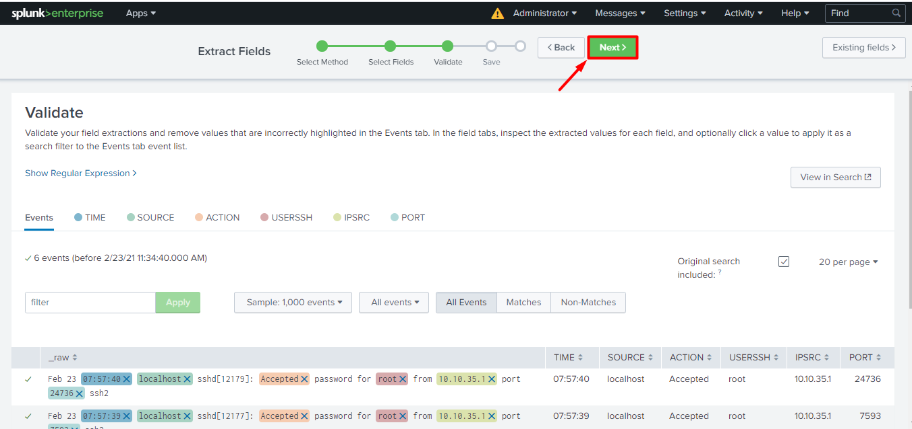

- Nhập vào tên cho extract này và chọn `Next` :

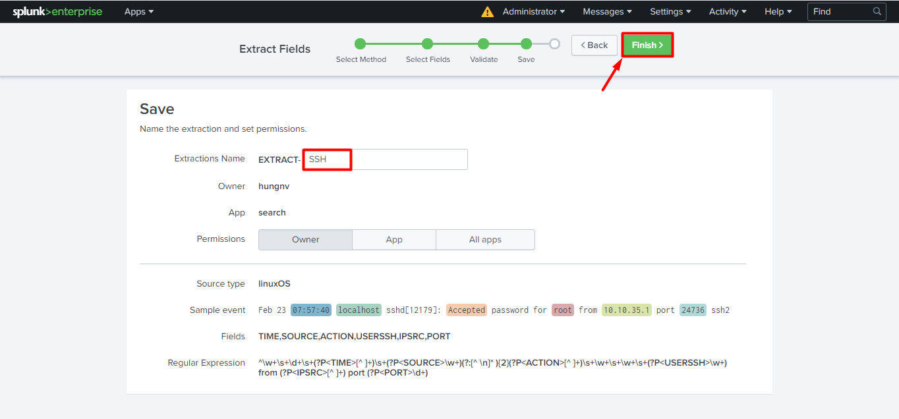

Sau khi tạo extract hãy thử ssh lại vào máy client và kiểm tra trên splunk xem log đã được extract hay chưa. 

Ta thấy rằng các trường đã được extract và đặt tên: 

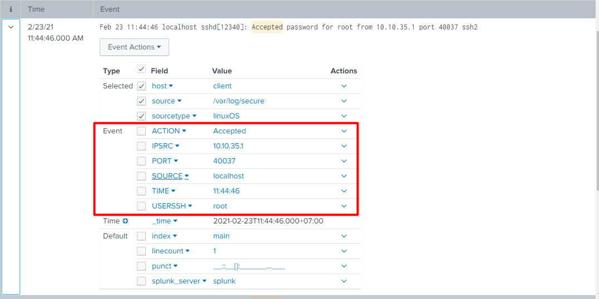

