# Cấu hình cảnh báo log ssh qua email

## Cấu hình email

Truy cập `Settings` > `Server Settings` > `Email  settings`

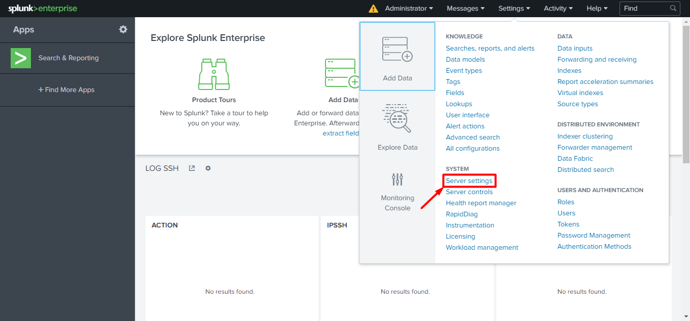

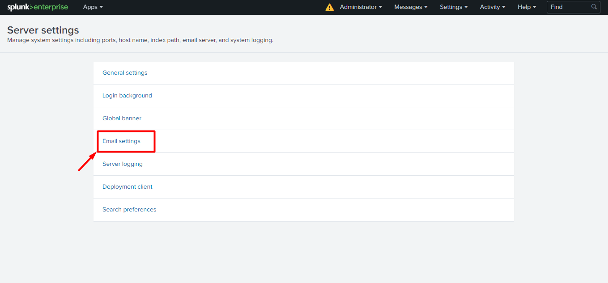

- Tại mục `Mail Server Settings` hãy cấu hình như sau: 

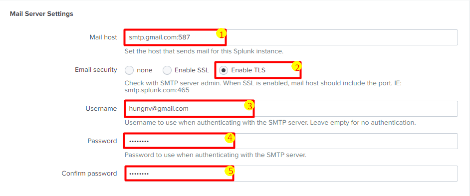

Trong đó: 

1. Nhập vào mail host là `smtp.gmail.com:587`
2. Chọn bảo mật là `TLS`
3. Nhập vào email sử dụng để gửi cảnh báo
4. Nhập vào mật khẩu của email đó
5. Một lần nữa, hãy nhập vào mật khẩu của email đó. 

- Tại `Email Format` hãy cấu hình như sau: 

Ở `Email footer` hãy nhập vào tiêu đề cho email. 

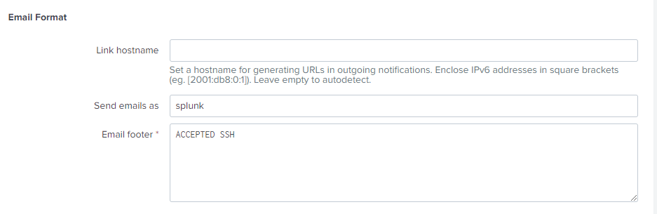

- Tiếp theo chọn `Save` để lưu lại:

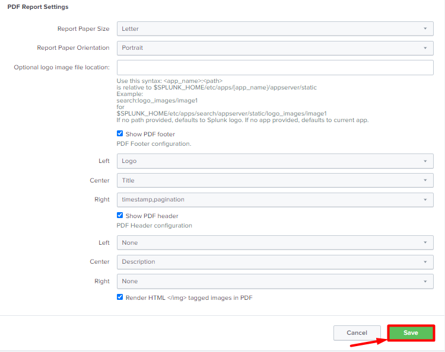

Sau đó hãy truy cập vào cài đặt tài khoản email trên và cho phép ứng dụng kém an toàn được truy cập. Bạn có thể truy cập theo đường link [tại đây!](https://myaccount.google.com/lesssecureapps)

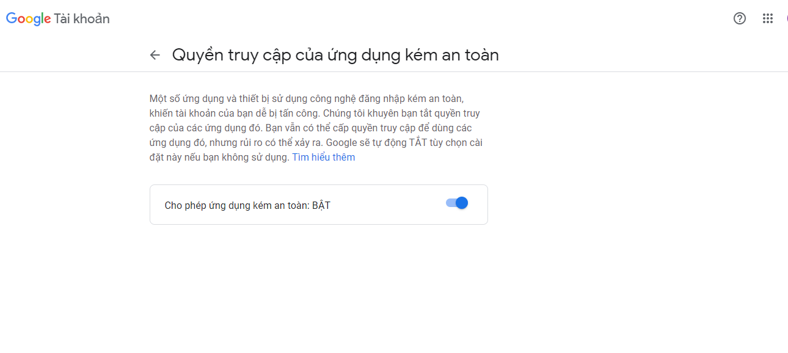

## Cấu hình cảnh báo

Để tạo cảnh báo, trước tiên bạn cần viết 1 truy vấn và lưu dưới dạng 1 cảnh báo. 

Do đã tạo extract và ta có thêm trường `ACTION` nên mình sẽ sử dụng cú pháp search là: `ACTION="Accepted"`, sau đó chọn `Save As` và lưu là `Alert`. 

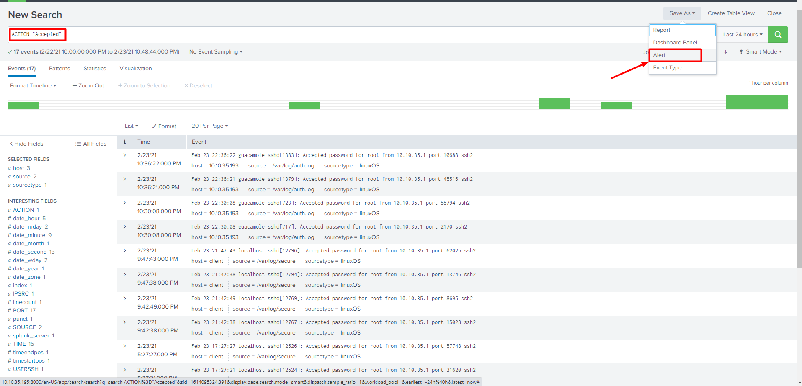

Tại mục `Alert`, ta đặt tên cho alert và `Alert type` ta đặt là `Real-time`: 

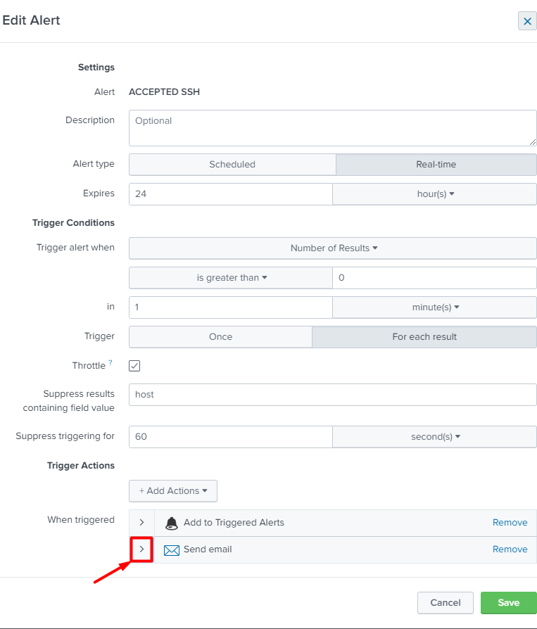

Sau đó chọn `Add Actions` và chọn `Send email`, sau đó cấu hình người nhận mail:

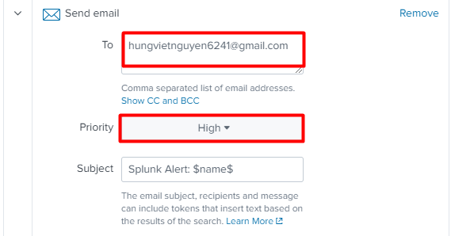

Tích chọn các thuộc tính bao gồm và chọn `Save` để lưu lại: 

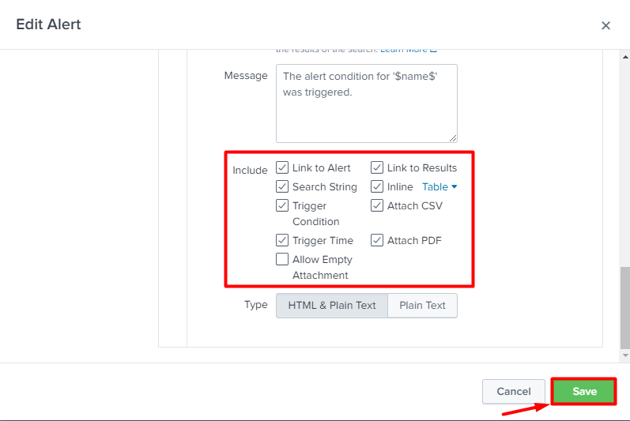

## Kiểm tra cảnh báo

Sau khi cấu hình, ta tiến hành ssh vào máy client và truy cập email để kiểm tra thấy cảnh báo gửi về như này là đã thành công: 

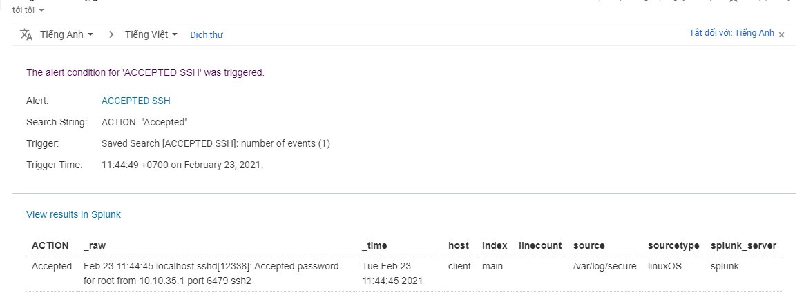